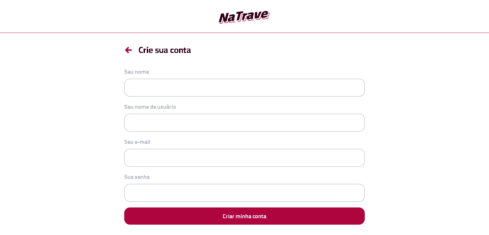
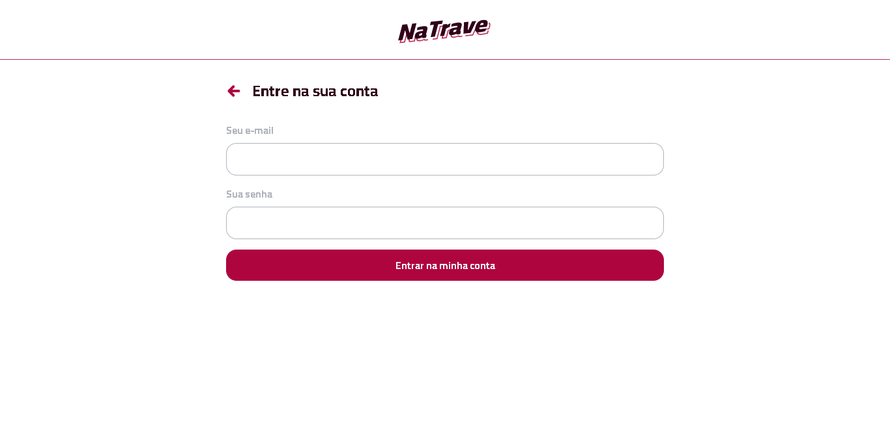
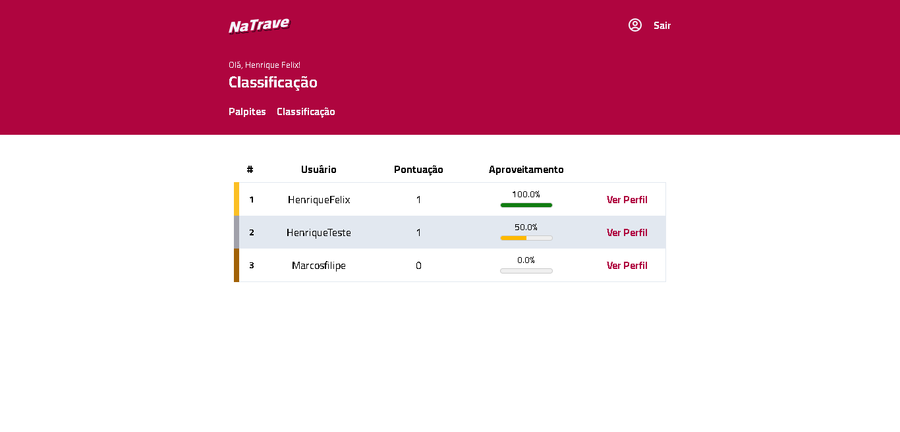
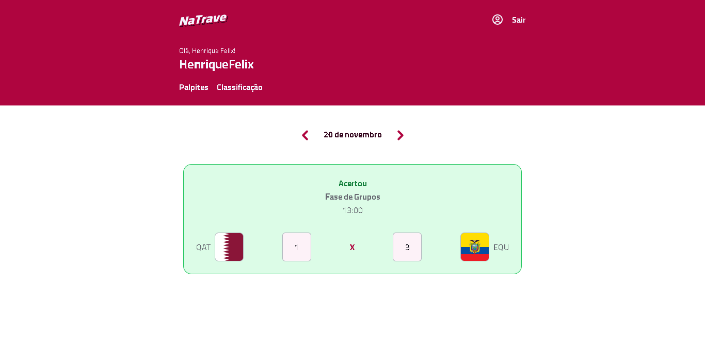

# NaTrave
Site de palpites dos jogos da Copa do Mundo Catar 2022 desenvolvido durante o evento da Codar.me chamado FullStack Challenge. Esse evento contou com 5 aulas, com duração de aproximadamente 2 horas cada.


- [Overview](#overview)
    - [Sobre o projeto](#sobre-o-projeto)
    - [Como executar](#como-executar)
    - [Funcionalidades extras](#funcionalidades-extras)
        - [Tela de dias sem partidas](#tela-de-dias-sem-partidas)
        - [Loading animado](#loading-animado)
        - [Sistema de feedback do envio de palpites](#sistema-de-feedback-do-envio-de-palpites)
        - [Alert de erro na requisição](#alert-de-erro-na-requisição)
        - [Sistema de feedback do resultado da partida](#sistema-de-feedback-do-resultado-da-partida)
        - [Leaderboard](#leaderboard)
        - [Hook customizado (useFetch)](#hook-customizado-usefetch)
        - [Autenticação usando Context](#autenticação-usando-context)
    - [Tecnologias utilizadas](#tecnologias-utilizadas)
    - [Screenshots](#screenshots)
    - [Deploy](#deploy)
- [Autor](#autor)

# Overview
## Sobre o projeto
Ao criar uma conta com o nome, usuário, email e senha, o usuário pode começar a enviar 
seus palpites para os jogos da Copa do Mundo 2022 do Catar. É possível também visualizar 
os palpites de outros usuários na tela de perfil.

## Como executar
1. Para rodar o projeto localmente basta fazer o clone deste repositório em sua máquina local:
```
    git clone https://github.com/HenriqueFelixDev/na-trave-frontend.git
```
ou [fazer o download](https://github.com/HenriqueFelixDev/na-trave-frontend/archive/refs/heads/main.zip) (caso não tenha o git instalado em seu computador) e descompactar o arquivo baixado.

2. Após ter o projeto em sua máquina entre no diretório/pasta do projeto e instale as dependências:
```
    npm install
```

3. Por fim, inicie a aplicação:
```
    npm run dev
```

> *Obs: É preciso fazer o clone ou download do projeto do backend e iniciá-lo antes de rodar o frontend. As instruções desse processo estão no [repositório do backend](https://github.com/HenriqueFelixDev/na-trave-api)*

## Funcionalidades extras
Como forma de desafio, foram adicionadas funcionalidades extras na aplicação que não foram implementadas durante o FullStack Challenge:

### Tela de dias sem partidas
Ao tentar acessar os jogos de um dia que não haverá partidas, uma tela com uma ilustração é exibida informando que não há partidas nesse dia.

### Loading animado
Uma animação de loading foi adicionada nas páginas de Leaderboard e de Palpites/Perfil enquando os dados são consultados no backend

### Sistema de feedback do envio de palpites
Após o usuário digitar o seu palpite, o card exibe um feedback do status do envio do palpite:
 - Uma animação de loading com o texto "enviando o palpite" enquanto o palpite está sendo enviado para o backend
 - Um ícone "check" e um texto "Palpite salvo" quando ocorre o sucesso na requisição
 - Um ícone "remove" (um X) com um texto "Erro ao salvar o palpite" quando ocorrer um erro na requisição

### Alert de erro na requisição
Nas requisições realizadas nas páginas Hunches e Leaderboard, quando um erro ocorre na requisição, uma caixa vermelha com a mensagem do erro é exibida.

### Sistema de feedback do resultado da partida
Quando o resultado da partida é atualizado no backend, não é mais possível editar o palpite daquela partida no frontend. Além disso, o estilo do card muda de acordo com o resultado da partida e o palpite do usuário:
 - Caso o usuário tenha errado o palpite ou não tenha feito palpite para aquela partida, o card fica vermelho e a mensagem "Errou" fica no topo dele.
 - Caso o usuário tenha acertado o palpite o card fica verde e a mensagem "Acertou" fica no topo dele.

### Leaderboard
Há uma tela com a classificação do bolão de acordo com o número de palpites certos. Cada vez que o resultado de uma partida é alterado, os palpites daquela partida de cada usuário é atualizado (o atributo won é atualizado). Para mais detalhes acesse o repositório [na-trave-api](https://github.com/HenriqueFelixDev/na-trave-api).
Os três primeiros usuários ficam com um estilo diferente dos outro:
 - O primeiro colocado fica com a borda esquerda da cor dourada
 - O segundo colocado fica com a borda esquerda da cor prateada.
 - O terceiro colocado fica com a borda esquerda da cor marrom.

Para cada usuário é exibido o número de palpites certos, o percentual de acerto (pontos / palpites) e um link para acessar o perfil do usuário.

Apenas os 10 primeiros colocados são exibidos e caso o usuário não esteja entre os 10, ele é exibido no final da classificação, com uma linha dividindo-o dos outros.

### Hook customizado (useFetch)
Tanto a tela de palpites quanto a de classificação possuem um fluxo semelhante:
 1. Uma requisição http é feita
 2. Enquanto a requisição é processada um loading é exibido
 3. Caso seja realizada com sucesso exibe os dados
 4. Caso ocorra um erro exibe um alerta

Para abstrair essa lógica foi criado um hook que retorna um array com 4 itens:

 1. Uma variável com os dados consultados (state, quando executa com sucesso)
 2. Uma variável booleana isLoading, informando se a requisição está sendo processada ou não
 3. Uma variável error com a mensagem de erro retornada ou undefined por padrão
 4. Uma função fetch que recebe como parâmetro a promise (requisição) que vai ser executada

### Autenticação usando Context
Para a autenticação do usuário foi utilizado Context API, que mantém os dados do usuário logado. Na inicialização da aplicação, ela verifica se os dados do usuário estão salvos no localStorage e, caso estejam, desserializa esses dados e atualiza o usuário do Context. Ao fazer login ou criar uma conta o usuário também é atualizado no Context e a aplicação redireciona para o dashboard.

> *Obs: Apenas as funcionalidades extras do frontend foram listadas. Para ver as funcionalidades extras do backend acesse o repositório [na-trave-api](https://github.com/HenriqueFelixDev/na-trave-api)*

## Tecnologias utilizadas
Para o desenvolvimento do frontend da aplicação foram utilizadas as seguintes tecnologias:

### Vite
[vitejs.dev](https://vitejs.dev/)


Ferramenta utilizada para a construção da aplicação com múltiplas funcionalidades, dentre elas:
 - Gerar um template inicial para o desenvolvimento
 - Criar um servidor de desenvolvimento com [Hot Module Replacement](https://vitejs.dev/guide/features.html#hot-module-replacement)
 - Possui um comando de build que gera um bundle otimizado para a produção

### React
[reactjs.org](https://reactjs.org/)


Biblioteca javascript para a criação de páginas da web interativas. É responsável pela manipulação do DOM, fazendo isso de forma performática, pois atualiza apenas as partes necessárias. Utiliza uma extensão de sintaxe da linguagem JavaScript chamada JSX, semelhante ao HTML, que permite construir as telas como elas devem parecer (embora o uso do JSX não seja obrigatório no React).

### TailwindCSS
[tailwindcss.com](https://tailwindcss.com/)


Framework CSS que trabalha com o conceito de classes utilitárias, que são classes pré-existentes que representam uma propriedade do CSS (ex: flex, justify-center, etc). É possível personalizar totalmente um elemento HTML apenas utilizando as classes do Tailwind, utilizar breakpoints (sm, md, etc) e alterar o elemento de acordo com um estado (focus, disabled, etc).

### Formik
[formik.org](https://formik.org/)


Biblioteca para a manipulação de formulários. O Formik simplifica a manipulação dos formulários pois permite adicionar validação aos campos do formulário, manipular os valores de cada campo sem a necessidade da utilização de [Controlled Components](https://reactjs.org/docs/forms.html#controlled-components) e controlar o envio (submit) dos dados.

### Yup
[Repositório do Yup no Github](https://github.com/jquense/yup)

Biblioteca para validação de dados. É altamente customizável, permitindo adicionar uma mensagem de erro personalizada para cada validação, além de possuir várias funções para validação de dados como email, required, min, max, url, etc, que em conjunto com o Formik torna muito simples a validação de um formulário.

### Tailed
[Repositório do Tailed no Github](https://github.com/brunobertolini/tailed)


Um dos grandes problemas do Tailwind é o fato de que se houver muitas classes em um mesmo elemento, o HTML acaba ficando ilegível. O Tailed permite criar elementos com uma sintaxe semelhante ao [Styled Components](https://styled-components.com/), simplificando a escrita das classes do Tailwind nos elementos. Exemplo:
```
    const post = tailed('article')`
        flex
        flex-col
        space-y-4
    `
```

### StyledBy
[Repositório do StyledBy no Github](https://github.com/brunobertolini/styled-by)


O StyledBy adiciona mais poder ao Tailed, pois permite modificar a estilização dos elementos criados com o Tailed com base em props. No exemplo abaixo o estilo é alterado de acordo com a prop **type**, em que se for *error* o texto é exibido em vermelho e se for *success*, é exibido em verde:
```
    const post = tailed('article')`
        ${styledBy('type', {
            'error': 'text-red-500',
            'success': 'text-green-500',
        })}
    `
```

## Screenshots

<div float="left">






</div>

## Deploy
O deploy da aplicação foi feito na Vercel, que conta com um plano gratuito, integração com o GitHub (CI/CD), certificado SSL gratuito entre diversos outros recursos. Após a configuração do projeto, todo push realizado no GitHub gera um novo deploy na Vercel. Além disso, por meio das Preview Branchs, é possível publicar diferentes versões da aplicação baseadas em diferentes branchs do GitHub.

# Autor
- Website - [https://henriquefelix.dev.br](https://henriquefelix.dev.br)
- Linkedin - [@henrique-felix-dev](https://www.linkedin.com/in/henrique-felix-dev/)
- FrontendMentor - [@henriquefelixdev](https://www.frontendmentor.io/profile/henriquefelixdev)